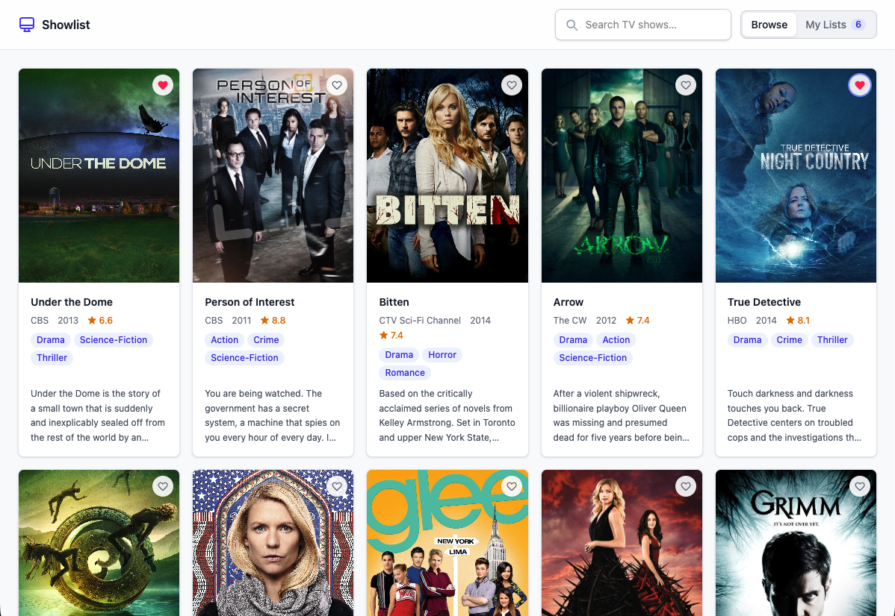
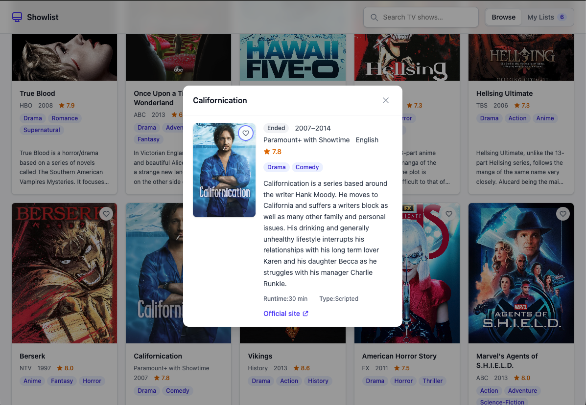
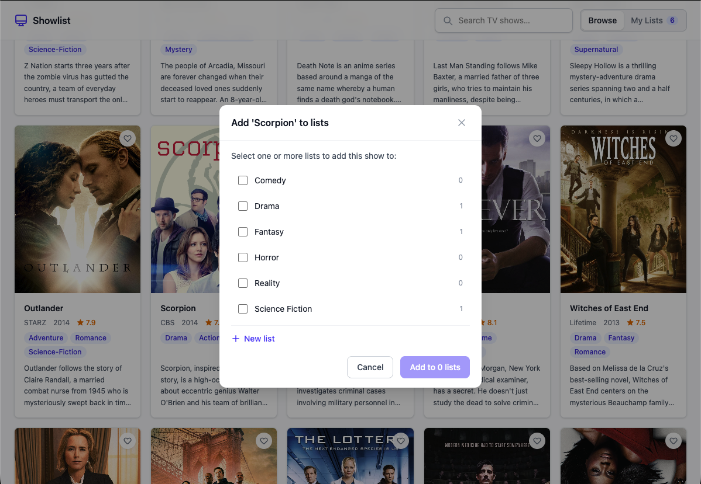
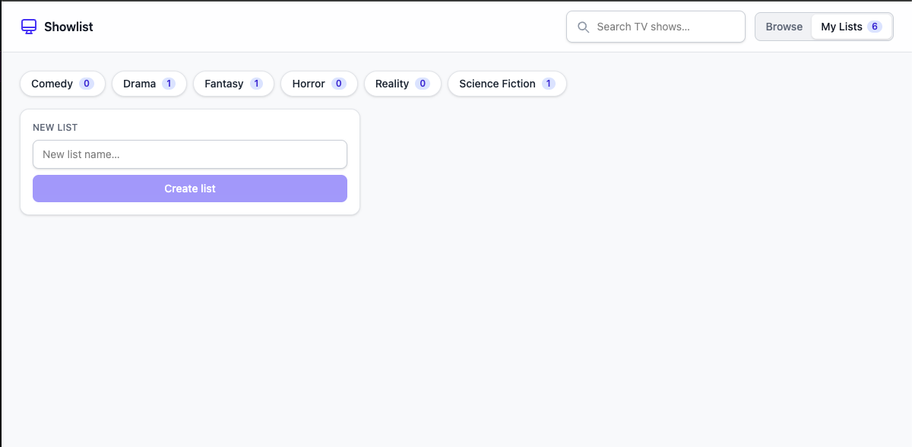
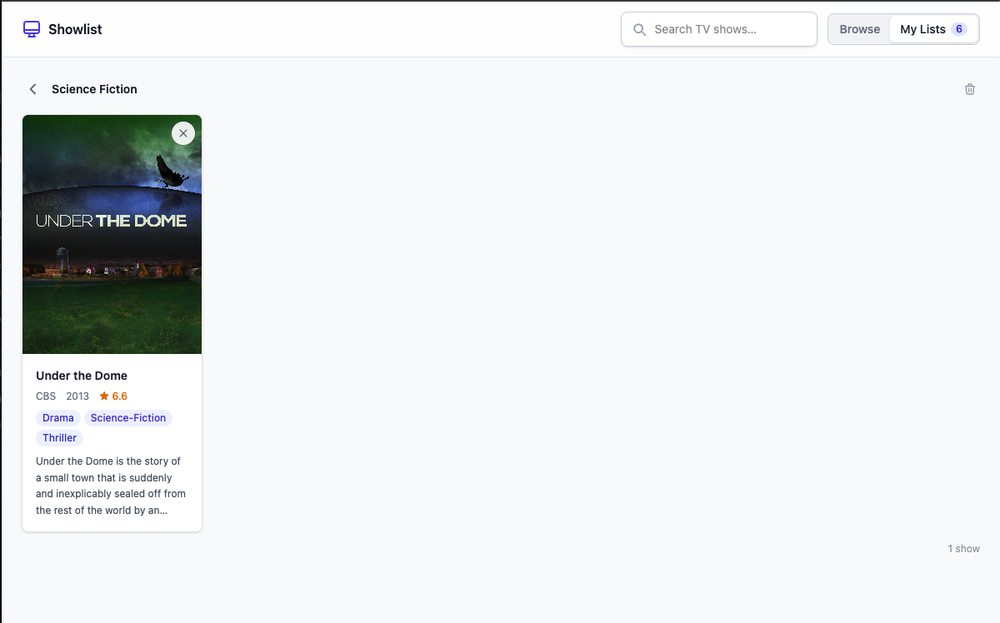

# Showlist

A small Laravel + Vue application for browsing television shows (via the
[TVmaze](https://www.tvmaze.com/api) API) and organizing them into favorite
lists.

> **Status: complete.** The application is implemented and tested end to end —
> TVmaze-backed search, favorite lists, and the single-screen Vue SPA all work.
> The backend (PHPUnit, 113 tests) and frontend (Vitest, 127 tests) suites pass,
> the production build succeeds, and Pint reports no style issues.

## What it does

- Browse an initial unfiltered list of TV shows.
- Search shows as you type (debounced; results in a responsive grid, capped at
  100).
- Open a show to see its details (full plain-text summary, genres, network,
  status, official-site link).
- Create multiple favorite lists and save a show to one or more of them.
- See lists alphabetically with a count of saved shows.
- View a list's favorites and remove individual favorites or delete a whole
  list.
- A filled heart on the Browse grid marks shows already saved in at least one
  list.

All interactions happen through JavaScript without full-page reloads. The Vue
frontend talks **only** to the Laravel API; **Laravel** is the only thing that
calls TVmaze:

```text
Vue frontend  ->  Laravel internal API (/api/*)  ->  TVmaze API
```

## Architecture

- **Laravel JSON API** under `/api/*` owns validation, persistence, TVmaze
  communication, response normalization, short-lived caching, and controlled
  errors. TVmaze HTML summaries are converted to plain text before they ever
  reach the client.
- **Minimal Blade shell** at `/` (`resources/views/app.blade.php`) loads the
  built assets and hosts a single mount point.
- **Vue 3 SPA** (Composition API, plain JS) mounts once into that shell — a
  standalone SPA, **not** an Inertia app, **no** Vue Router. Browse and
  Favorites are state-driven modes on one screen.
- **Pinia** holds the two genuinely shared stores (`stores/shows.js`,
  `stores/favoriteLists.js`); transient UI state stays local to components.
- API calls use native **`fetch`** + `AbortController` via `services/api.js`
  (no Axios).
- Favorite records store **snapshots** of show data, so a saved show is
  independent of any shared shows table.
- The JSON API boundary keeps the frontend portable to a future Symfony backend.

See [docs/ARCHITECTURE.md](docs/ARCHITECTURE.md) and
[docs/DECISIONS.md](docs/DECISIONS.md) for the full rationale.

## API endpoints

| Method | Endpoint | Purpose |
| --- | --- | --- |
| `GET` | `/api/shows?q=` | Search/browse shows (normalized, ≤100) |
| `GET` | `/api/favorites/ids` | Distinct `external_id`s saved across all lists |
| `GET` | `/api/favorite-lists` | All lists (alphabetical, with counts) |
| `POST` | `/api/favorite-lists` | Create a list |
| `GET` | `/api/favorite-lists/{list}` | A list with its favorites |
| `DELETE` | `/api/favorite-lists/{list}` | Delete a list |
| `POST` | `/api/favorite-lists/{list}/favorites` | Add a show snapshot to a list |
| `DELETE` | `/api/favorite-lists/{list}/favorites/{favorite}` | Remove a favorite |

Full request/response shapes: [docs/API_CONTRACT.md](docs/API_CONTRACT.md).

## Stack

- Laravel 13 (PHP 8.4) — JSON API + minimal Blade shell
- Vue 3 (Composition API) — plain JavaScript, **no TypeScript**; standalone SPA
- Pinia for shared frontend state
- Native `fetch` + `AbortController` (no Axios)
- Vite, Tailwind CSS 4
- SQLite
- Laravel HTTP client (for TVmaze)
- PHPUnit (backend) · Vitest + Vue Test Utils (frontend)

There is no authentication — by design, a larger parent application is assumed to
provide it.

## Requirements

- **PHP 8.3+** (developed on 8.4) with the usual Laravel extensions and the
  SQLite (`pdo_sqlite`) extension
- **Composer**
- **Node.js 20+** (developed on 22) and **npm**

No database server is needed — the app uses a local SQLite file.

## Local setup (from a clean clone)

```bash
# 1. PHP dependencies
composer install

# 2. JS dependencies
npm install

# 3. Environment file + app key
cp .env.example .env
php artisan key:generate

# 4. SQLite database + schema
#    The database file is gitignored, so it does NOT exist after a fresh clone —
#    create it before migrating.
touch database/database.sqlite
php artisan migrate

# 5. Build the frontend (or use the dev server below)
npm run build
```

The project is configured for SQLite (`DB_CONNECTION=sqlite`) using
`database/database.sqlite`. The TVmaze base URL and timeout come from
`TVMAZE_BASE_URL` / `TVMAZE_TIMEOUT` in `.env` (defaults provided in
`.env.example`).

## Running the app

The frontend assets must be available before the page will render — either build
them once or run the Vite dev server. Pick one of the two flows below.

**Production-style (built assets):**

```bash
npm run build         # build assets (step 5 above already does this)
php artisan serve     # serve the app at http://127.0.0.1:8000
```

**Development (hot reload):** run both, in separate terminals.

```bash
php artisan serve     # Laravel backend at http://127.0.0.1:8000
npm run dev           # Vite dev server (HMR)
```

Then open http://127.0.0.1:8000. (If you see a "Vite manifest not found" error,
you have neither built the assets nor started `npm run dev` — do one of them.)

## Tests, build, and style

```bash
php artisan test          # Backend — PHPUnit (SQLite :memory:)
npm run test              # Frontend — Vitest + Vue Test Utils
npm run build             # Production frontend build
./vendor/bin/pint --test  # PHP code-style check
```

Automated backend tests **never** call the live TVmaze API — all upstream HTTP is
faked with `Http::fake()`.

## Screenshots

**Browse / search grid** — type to search; the heart fills for shows already
saved to a list.



**Show details** — click a poster or title to open the full details modal
(plain-text summary, all genres, official-site link).



**Add to lists** — save a show to one or more favorite lists from a single
picker.



**My Lists** — all lists with their counts, plus a form to create a new one.



**List details** — a selected list's saved shows as a grid; remove individually
or delete the whole list.



## Known limitations

- **Search is title-based only.** TVmaze exposes name/title search; there is no
  genre or free-text description search upstream. A client-side **genre filter**
  over already-fetched results is captured in
  [docs/BACKLOG.md](docs/BACKLOG.md) but not implemented.
- **Results are capped at 100** to keep payloads and rendering bounded.
- **No authentication** (by design — see above).
- Favorites store snapshots taken at save time, so a saved show does not
  retro-update if TVmaze later changes that show's data.

## Documentation

| Document | Purpose |
| --- | --- |
| [docs/PROJECT_PLAN.md](docs/PROJECT_PLAN.md) | Scope, phased plan, definition of done, risks |
| [docs/BUILD_PLAN.md](docs/BUILD_PLAN.md) | Sequential implementation checklist |
| [docs/ARCHITECTURE.md](docs/ARCHITECTURE.md) | Architecture and folder structure |
| [docs/API_CONTRACT.md](docs/API_CONTRACT.md) | Internal Laravel API contract |
| [docs/DATABASE_DESIGN.md](docs/DATABASE_DESIGN.md) | SQLite schema |
| [docs/DECISIONS.md](docs/DECISIONS.md) | Architecture decision records |
| [docs/TESTING_STRATEGY.md](docs/TESTING_STRATEGY.md) | Testing approach and policy |
| [docs/IMPLEMENTATION_LOG.md](docs/IMPLEMENTATION_LOG.md) | Per-phase verification record |
| [docs/AI_WORKFLOW.md](docs/AI_WORKFLOW.md) | AI-assisted development process |
| [docs/BACKLOG.md](docs/BACKLOG.md) | Deferred enhancement ideas |

## AI-assistance disclosure

AI tooling (Claude Code) was used throughout this project to accelerate the
work — scaffolding, drafting implementation, and assisting with review and
documentation. The architecture, design decisions, and trade-offs were directed
and owned by the developer, who reviewed and corrected all AI-generated output.
The work followed a documented, phase-by-phase workflow with explicit review and
handoff steps (`/review-feature`, `/feature-handoff`) and specialized agents, and
every command and test reported as passing was actually run before being relied
upon. See [docs/AI_WORKFLOW.md](docs/AI_WORKFLOW.md) for details.
